# File Home Software Design Specification

| Item | Value |
| --- | --- |
| System | File Home personal cloud drive |
| Version | 4.0 |
| Date | 2026-11-04 |
| Stack | Spring Boot 4, Vue 3, MySQL, Redis, MinIO, Kafka, Nginx |
| Language | English |
| Other versions | [中文](./software-design-specification-zh.md) / [Portugues](./software-design-specification-pt.md) |

## 1. Purpose

This specification describes the implemented File Home system using UML views and engineering constraints. The design is a modular monolith that can be horizontally scaled. It separates durable metadata, rebuildable cache, object content, and asynchronous audit events.

## 2. Scope

Implemented capabilities:

- Registration, browser login, logout, password change, and account deactivation
- HttpOnly sessions, CSRF protection, rate limiting, and immediate session revocation
- Avatar upload, normalization, storage, and cache invalidation
- Directory browsing, search, sort, rename, move, copy, trash, restore, and delete
- Direct small-file upload and resumable multipart upload for files above 8 MiB
- MinIO multipart sessions, per-part SHA-256, Redis part locks, and quota reservation
- Streaming downloads, folder ZIP, Range media preview, and short-lived preview tickets
- Image, audio, video, PDF, text, source-code, and DOCX read-only preview
- Random share links, extraction codes, authenticated download, and share revocation
- Kafka-backed asynchronous activity audit with an idempotent database consumer
- User preferences, account security settings, and configurable upload concurrency
- `fhterm` CLI for cmd.exe, PowerShell, Git Bash, and Linux shells
- Windows scripts and Linux Docker Compose deployment

Current boundaries:

- Data infrastructure is still single-node in the local profile
- Kafka topic replication is 1 in the local profile
- No MFA, virus scanner, CDN, server-side Office conversion, or admin console
- Recursive file jobs still execute inside the web process
- Legacy `.doc` files are not rendered

## 3. Actors

| Actor | Responsibility |
| --- | --- |
| Visitor | Opens a public share and views metadata |
| Registered user | Manages files, shares, previews, downloads, and settings |
| CLI user | Uses the same REST API through `fhterm` |
| Operations | Starts services, checks health, manages backup and logs |
| Kafka consumer | Persists activity events asynchronously |

## 4. Context

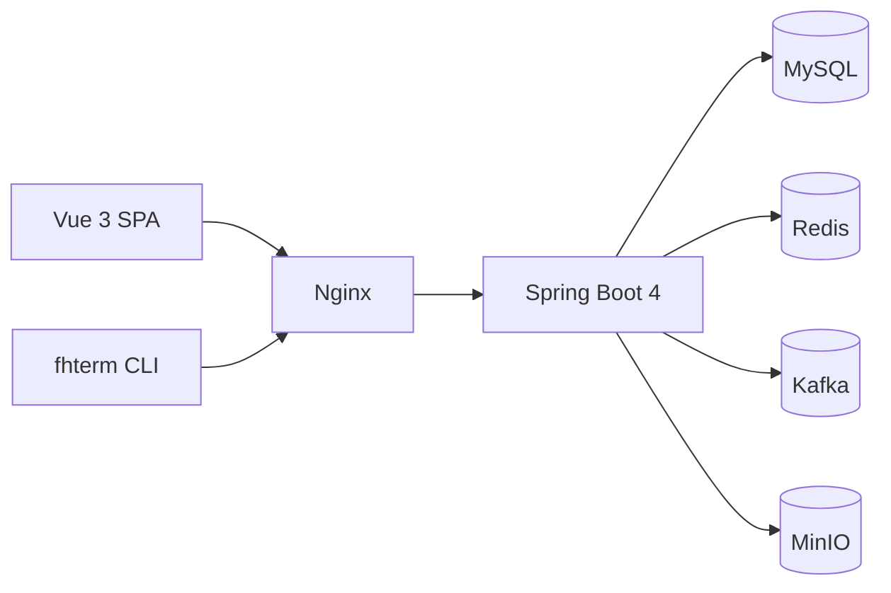
```mermaid
flowchart LR
    Browser["Vue 3 SPA"]
    CLI["fhterm CLI"]
    Nginx["Nginx"]
    Backend["Spring Boot 4"]
    MySQL[("MySQL")]
    Redis[("Redis")]
    Kafka[("Kafka")]
    MinIO[("MinIO")]

    Browser --> Nginx
    CLI --> Nginx
    Nginx --> Backend
    Backend --> MySQL
    Backend --> Redis
    Backend --> Kafka
    Backend --> MinIO
```

Core decisions:

1. Strongly consistent metadata remains in MySQL.
2. Redis stores only rebuildable data, rate counters, session resolution, and upload locks.
3. File bytes and avatars are stored in MinIO.
4. Kafka carries asynchronous audit events only, not authoritative file state.
5. Browser code never receives MinIO credentials or MinIO upload IDs.
6. Controllers never call MyBatis mappers or MinIO adapters directly.

## 5. Use Case Diagram

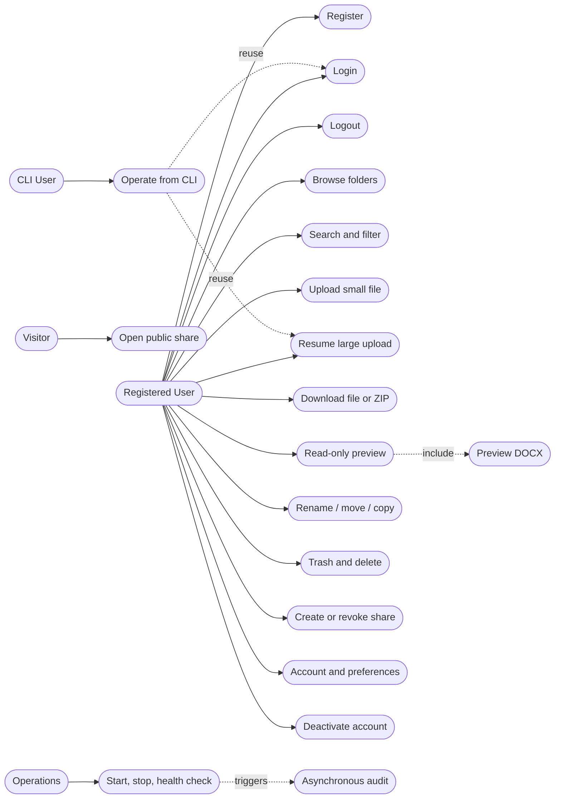
```mermaid
flowchart LR
    Visitor(["Visitor"])
    User(["Registered User"])
    CliUser(["CLI User"])
    Ops(["Operations"])

    OpenShare(["Open public share"])
    Register(["Register"])
    Login(["Login"])
    Logout(["Logout"])
    Browse(["Browse folders"])
    Search(["Search and filter"])
    UploadSmall(["Upload small file"])
    UploadLarge(["Resume large upload"])
    Download(["Download file or ZIP"])
    Preview(["Read-only preview"])
    Docx(["Preview DOCX"])
    Mutate(["Rename / move / copy"])
    Trash(["Trash and delete"])
    Share(["Create or revoke share"])
    Settings(["Account and preferences"])
    Deactivate(["Deactivate account"])
    Cli(["Operate from CLI"])
    Operate(["Start, stop, health check"])
    Audit(["Asynchronous audit"])

    Visitor --> OpenShare
    User --> Register
    User --> Login
    User --> Logout
    User --> Browse
    User --> Search
    User --> UploadSmall
    User --> UploadLarge
    User --> Download
    User --> Preview
    Preview -.->|include| Docx
    User --> Mutate
    User --> Trash
    User --> Share
    User --> Settings
    User --> Deactivate
    CliUser --> Cli
    Cli -.->|reuse| Login
    Cli -.->|reuse| UploadLarge
    Ops --> Operate
    Operate -.->|triggers| Audit
```

Principal rules:

- Every file operation checks ownership.
- Share URLs contain random tokens, never database IDs or object keys.
- A folder share is recursive by relationship, not by copying child snapshots.
- Account deactivation disables login and revokes sessions without immediate physical deletion.
- Audit history may reference an entry that has already been deleted.

## 6. Activity Diagram

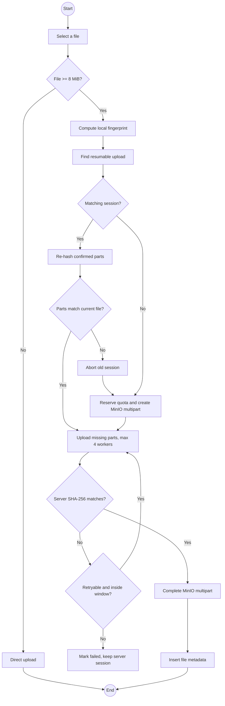
```mermaid
flowchart TD
    Start((Start))
    Select["Select a file"]
    Large{"File >= 8 MiB?"}
    Small["Direct upload"]
    Fingerprint["Compute local fingerprint"]
    Find["Find resumable upload"]
    Exists{"Matching session?"}
    Verify["Re-hash confirmed parts"]
    Match{"Parts match current file?"}
    AbortOld["Abort old session"]
    Init["Reserve quota and create MinIO multipart"]
    Transfer["Upload missing parts, max 4 workers"]
    Integrity{"Server SHA-256 matches?"}
    Retryable{"Retryable and inside window?"}
    Failed["Mark failed, keep server session"]
    Complete["Complete MinIO multipart"]
    Register["Insert file metadata"]
    End((End))

    Start --> Select --> Large
    Large -->|No| Small --> End
    Large -->|Yes| Fingerprint --> Find --> Exists
    Exists -->|Yes| Verify --> Match
    Match -->|Yes| Transfer
    Match -->|No| AbortOld --> Init
    Exists -->|No| Init --> Transfer
    Transfer --> Integrity
    Integrity -->|No| Retryable
    Retryable -->|Yes| Transfer
    Retryable -->|No| Failed
    Integrity -->|Yes| Complete --> Register --> End
```

## 7. Sequence Diagrams

### 7.1 Login and session resolution

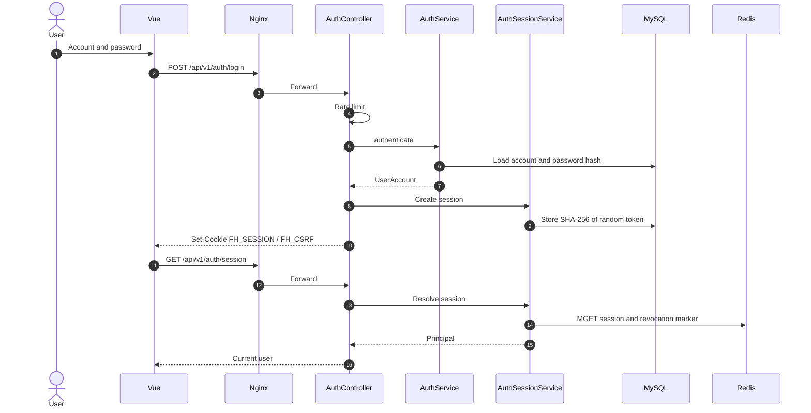
```mermaid
sequenceDiagram
    autonumber
    actor U as User
    participant B as Vue
    participant N as Nginx
    participant A as AuthController
    participant S as AuthService
    participant R as AuthSessionService
    participant D as MySQL
    participant C as Redis

    U->>B: Account and password
    B->>N: POST /api/v1/auth/login
    N->>A: Forward
    A->>A: Rate limit
    A->>S: authenticate
    S->>D: Load account and password hash
    S-->>A: UserAccount
    A->>R: Create session
    R->>D: Store SHA-256 of random token
    A-->>B: Set-Cookie FH_SESSION / FH_CSRF
    B->>N: GET /api/v1/auth/session
    N->>A: Forward
    A->>R: Resolve session
    R->>C: MGET session and revocation marker
    R-->>A: Principal
    A-->>B: Current user
```

### 7.2 Multipart upload

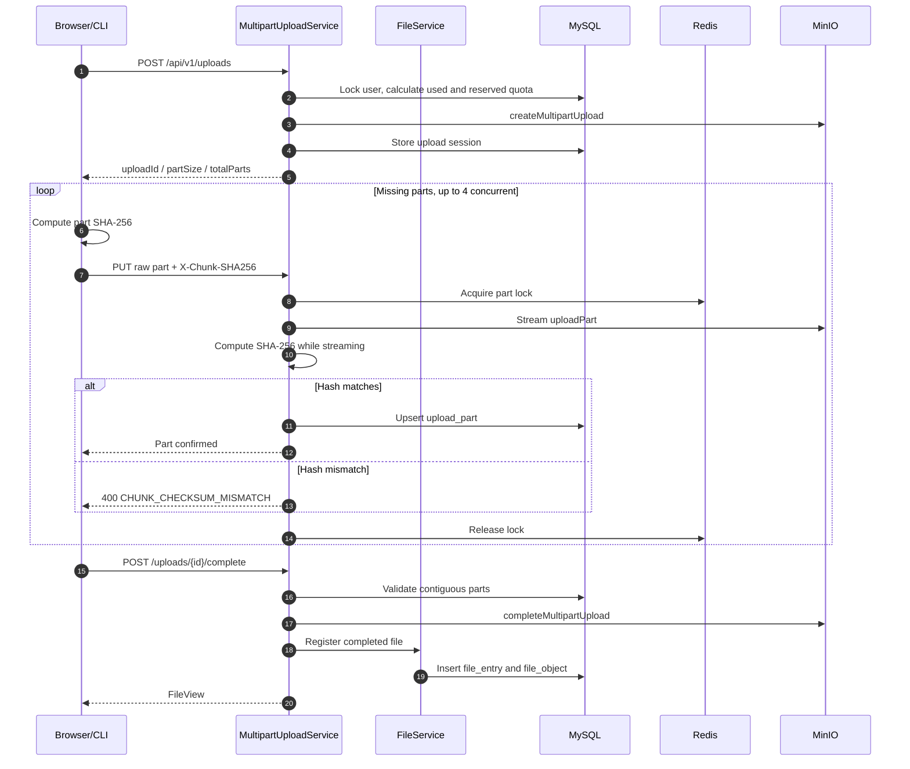
```mermaid
sequenceDiagram
    autonumber
    participant B as Browser/CLI
    participant U as MultipartUploadService
    participant F as FileService
    participant Q as MySQL
    participant L as Redis
    participant M as MinIO

    B->>U: POST /api/v1/uploads
    U->>Q: Lock user, calculate used and reserved quota
    U->>M: createMultipartUpload
    U->>Q: Store upload session
    U-->>B: uploadId / partSize / totalParts
    loop Missing parts, up to 4 concurrent
        B->>B: Compute part SHA-256
        B->>U: PUT raw part + X-Chunk-SHA256
        U->>L: Acquire part lock
        U->>M: Stream uploadPart
        U->>U: Compute SHA-256 while streaming
        alt Hash matches
            U->>Q: Upsert upload_part
            U-->>B: Part confirmed
        else Hash mismatch
            U-->>B: 400 CHUNK_CHECKSUM_MISMATCH
        end
        U->>L: Release lock
    end
    B->>U: POST /uploads/{id}/complete
    U->>Q: Validate contiguous parts
    U->>M: completeMultipartUpload
    U->>F: Register completed file
    F->>Q: Insert file_entry and file_object
    U-->>B: FileView
```

### 7.3 DOCX preview

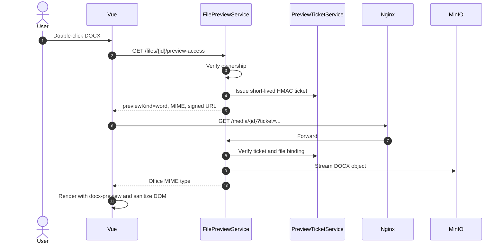
```mermaid
sequenceDiagram
    autonumber
    actor U as User
    participant B as Vue
    participant P as FilePreviewService
    participant T as PreviewTicketService
    participant N as Nginx
    participant M as MinIO

    U->>B: Double-click DOCX
    B->>P: GET /files/{id}/preview-access
    P->>P: Verify ownership
    P->>T: Issue short-lived HMAC ticket
    P-->>B: previewKind=word, MIME, signed URL
    B->>N: GET /media/{id}?ticket=...
    N->>P: Forward
    P->>T: Verify ticket and file binding
    P->>M: Stream DOCX object
    P-->>B: Office MIME type
    B->>B: Render with docx-preview and sanitize DOM
```

### 7.4 Kafka audit

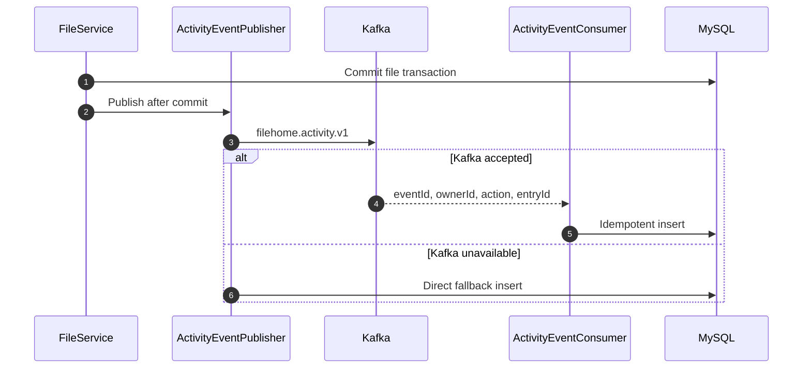
```mermaid
sequenceDiagram
    autonumber
    participant F as FileService
    participant P as ActivityEventPublisher
    participant K as Kafka
    participant C as ActivityEventConsumer
    participant D as MySQL

    F->>D: Commit file transaction
    F->>P: Publish after commit
    P->>K: filehome.activity.v1
    alt Kafka accepted
        K-->>C: eventId, ownerId, action, entryId
        C->>D: Idempotent insert
    else Kafka unavailable
        P->>D: Direct fallback insert
    end
```

## 8. Communication Diagram

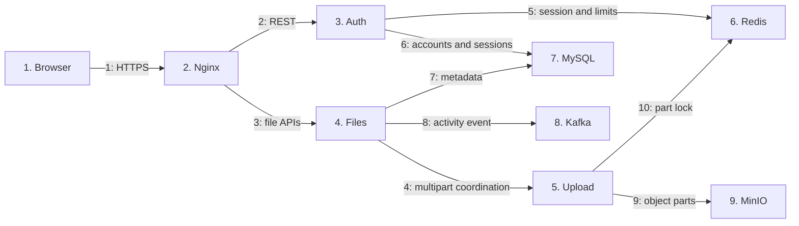
```mermaid
flowchart LR
    Browser["1. Browser"]
    Nginx["2. Nginx"]
    Auth["3. Auth"]
    File["4. Files"]
    Upload["5. Upload"]
    Redis["6. Redis"]
    MySQL["7. MySQL"]
    Kafka["8. Kafka"]
    MinIO["9. MinIO"]

    Browser -- "1: HTTPS" --> Nginx
    Nginx -- "2: REST" --> Auth
    Nginx -- "3: file APIs" --> File
    File -- "4: multipart coordination" --> Upload
    Auth -- "5: session and limits" --> Redis
    Auth -- "6: accounts and sessions" --> MySQL
    File -- "7: metadata" --> MySQL
    File -- "8: activity event" --> Kafka
    Upload -- "9: object parts" --> MinIO
    Upload -- "10: part lock" --> Redis
```

## 9. Interaction Overview Diagram

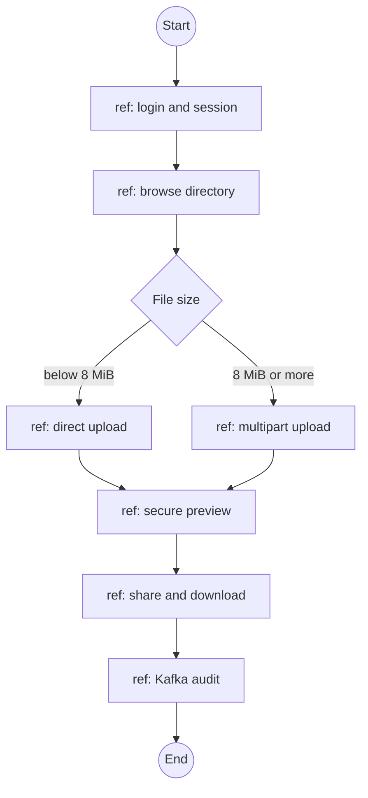
```mermaid
flowchart TD
    Start((Start))
    Login["ref: login and session"]
    Browse["ref: browse directory"]
    Decision{"File size"}
    Small["ref: direct upload"]
    Large["ref: multipart upload"]
    Preview["ref: secure preview"]
    Share["ref: share and download"]
    Audit["ref: Kafka audit"]
    End((End))

    Start --> Login --> Browse --> Decision
    Decision -->|below 8 MiB| Small
    Decision -->|8 MiB or more| Large
    Small --> Preview
    Large --> Preview
    Preview --> Share --> Audit --> End
```

## 10. Timing Diagram

```mermaid
gantt
    title Session and multipart recovery timing
    dateFormat X
    axisFormat %S
    section Browser session
    Valid session :active, s1, 0, 3600
    section Multipart
    Four concurrent parts :a1, 10, 25
    Network outage :crit, a2, 35, 20
    Exponential backoff with jitter :a3, 35, 46
    Server session remains resumable :active, a4, 35, 100
    User must reselect file :milestone, m1, 82, 0
```

Retry policy:

- Ordinary idempotent APIs commonly use three attempts.
- Long-running resumable operations commonly use five to eight attempts.
- File Home uses up to eight network attempts with randomized exponential backoff.
- The server-side upload session survives for 48 hours.

## 11. State Machine Diagrams

### 11.1 File lifecycle

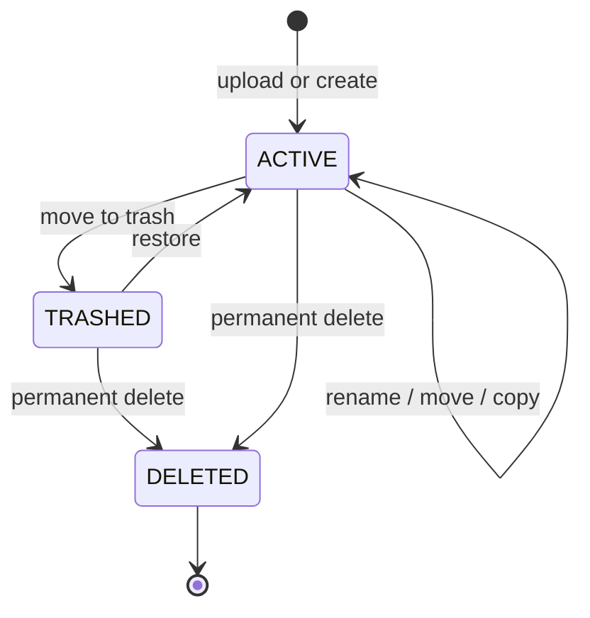
```mermaid
stateDiagram-v2
    [*] --> ACTIVE: upload or create
    ACTIVE --> ACTIVE: rename / move / copy
    ACTIVE --> TRASHED: move to trash
    TRASHED --> ACTIVE: restore
    TRASHED --> DELETED: permanent delete
    ACTIVE --> DELETED: permanent delete
    DELETED --> [*]
```

### 11.2 Upload lifecycle

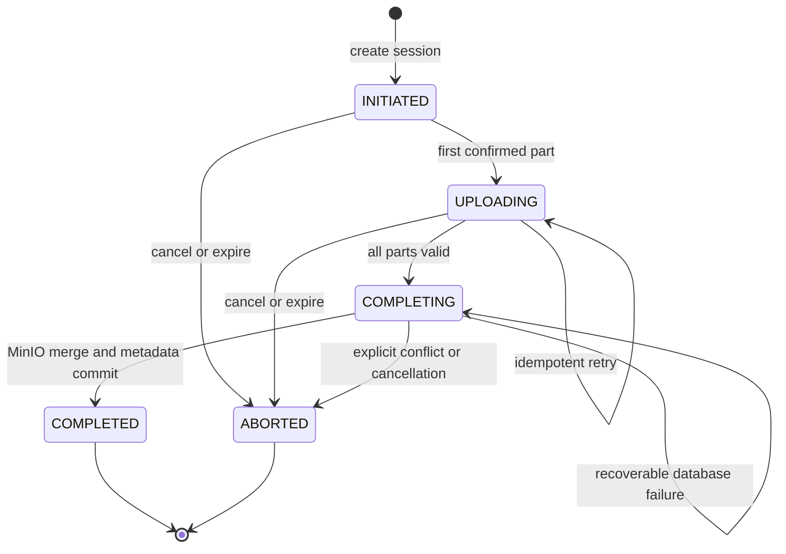
```mermaid
stateDiagram-v2
    [*] --> INITIATED: create session
    INITIATED --> UPLOADING: first confirmed part
    UPLOADING --> UPLOADING: idempotent retry
    UPLOADING --> COMPLETING: all parts valid
    COMPLETING --> COMPLETED: MinIO merge and metadata commit
    COMPLETING --> COMPLETING: recoverable database failure
    INITIATED --> ABORTED: cancel or expire
    UPLOADING --> ABORTED: cancel or expire
    COMPLETING --> ABORTED: explicit conflict or cancellation
    COMPLETED --> [*]
    ABORTED --> [*]
```

### 11.3 Account lifecycle

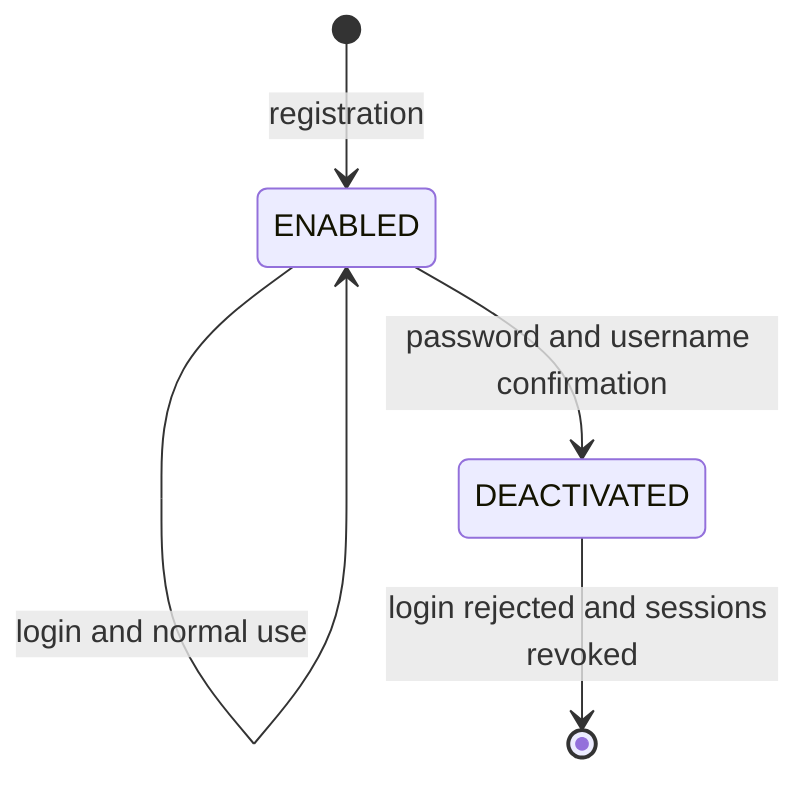
```mermaid
stateDiagram-v2
    [*] --> ENABLED: registration
    ENABLED --> ENABLED: login and normal use
    ENABLED --> DEACTIVATED: password and username confirmation
    DEACTIVATED --> [*]: login rejected and sessions revoked
```

## 12. Class Diagrams

### 12.1 Domain model

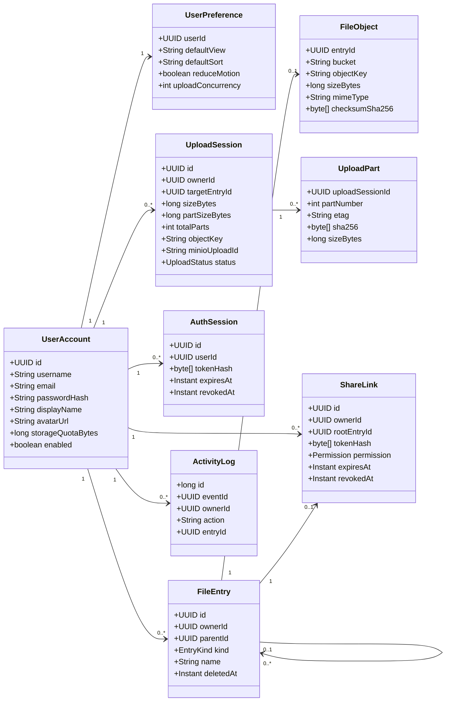
```mermaid
classDiagram
    direction LR
    class UserAccount {
        +UUID id
        +String username
        +String email
        +String passwordHash
        +String displayName
        +String avatarUrl
        +long storageQuotaBytes
        +boolean enabled
    }
    class UserPreference {
        +UUID userId
        +String defaultView
        +String defaultSort
        +boolean reduceMotion
        +int uploadConcurrency
    }
    class FileEntry {
        +UUID id
        +UUID ownerId
        +UUID parentId
        +EntryKind kind
        +String name
        +Instant deletedAt
    }
    class FileObject {
        +UUID entryId
        +String bucket
        +String objectKey
        +long sizeBytes
        +String mimeType
        +byte[] checksumSha256
    }
    class AuthSession {
        +UUID id
        +UUID userId
        +byte[] tokenHash
        +Instant expiresAt
        +Instant revokedAt
    }
    class UploadSession {
        +UUID id
        +UUID ownerId
        +UUID targetEntryId
        +long sizeBytes
        +long partSizeBytes
        +int totalParts
        +String objectKey
        +String minioUploadId
        +UploadStatus status
    }
    class UploadPart {
        +UUID uploadSessionId
        +int partNumber
        +String etag
        +byte[] sha256
        +long sizeBytes
    }
    class ShareLink {
        +UUID id
        +UUID ownerId
        +UUID rootEntryId
        +byte[] tokenHash
        +Permission permission
        +Instant expiresAt
        +Instant revokedAt
    }
    class ActivityLog {
        +long id
        +UUID eventId
        +UUID ownerId
        +String action
        +UUID entryId
    }

    UserAccount "1" --> "1" UserPreference
    UserAccount "1" --> "0..*" FileEntry
    UserAccount "1" --> "0..*" AuthSession
    UserAccount "1" --> "0..*" UploadSession
    UserAccount "1" --> "0..*" ShareLink
    UserAccount "1" --> "0..*" ActivityLog
    FileEntry "0..1" --> "0..*" FileEntry
    FileEntry "1" --> "0..1" FileObject
    UploadSession "1" --> "0..*" UploadPart
    FileEntry "1" --> "0..1" ShareLink
```

### 12.2 Application services and ports

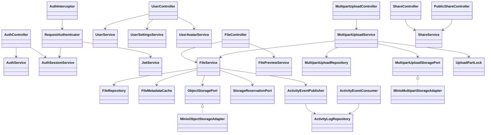
```mermaid
classDiagram
    AuthController --> AuthService
    AuthController --> AuthSessionService
    AuthInterceptor --> RequestAuthenticator
    RequestAuthenticator --> JwtService
    RequestAuthenticator --> AuthSessionService

    UserController --> UserService
    UserController --> UserSettingsService
    UserController --> UserAvatarService

    FileController --> FileService
    FileController --> FilePreviewService
    FileService --> FileRepository
    FileService --> FileMetadataCache
    FileService --> ObjectStoragePort
    FileService --> StorageReservationPort

    MultipartUploadController --> MultipartUploadService
    MultipartUploadService --> MultipartUploadRepository
    MultipartUploadService --> MultipartUploadStoragePort
    MultipartUploadService --> UploadPartLock
    MultipartUploadService --> FileService

    ShareController --> ShareService
    PublicShareController --> ShareService
    FileService --> ActivityEventPublisher
    ActivityEventPublisher --> ActivityLogRepository
    ActivityEventConsumer --> ActivityLogRepository

    ObjectStoragePort <|.. MinioObjectStorageAdapter
    MultipartUploadStoragePort <|.. MinioMultipartStorageAdapter
```

## 13. Object Diagram

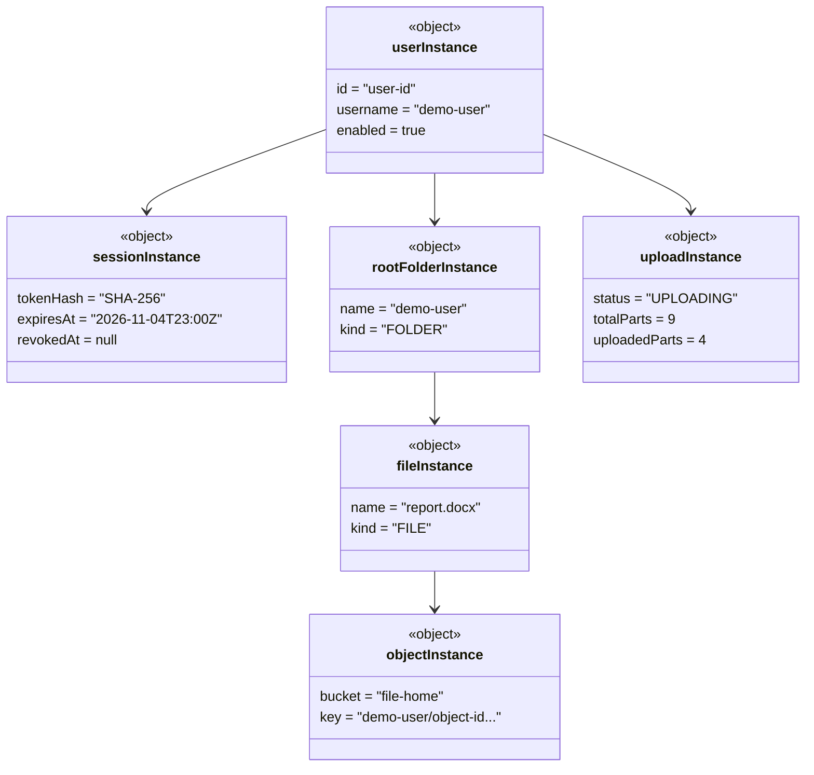
```mermaid
classDiagram
    class userInstance {
        <<object>>
        id = "user-id"
        username = "demo-user"
        enabled = true
    }
    class sessionInstance {
        <<object>>
        tokenHash = "SHA-256"
        expiresAt = "2026-11-04T23:00Z"
        revokedAt = null
    }
    class rootFolderInstance {
        <<object>>
        name = "demo-user"
        kind = "FOLDER"
    }
    class fileInstance {
        <<object>>
        name = "report.docx"
        kind = "FILE"
    }
    class uploadInstance {
        <<object>>
        status = "UPLOADING"
        totalParts = 9
        uploadedParts = 4
    }
    class objectInstance {
        <<object>>
        bucket = "file-home"
        key = "demo-user/object-id..."
    }

    userInstance --> sessionInstance
    userInstance --> rootFolderInstance
    rootFolderInstance --> fileInstance
    fileInstance --> objectInstance
    userInstance --> uploadInstance
```

## 14. Package Diagram

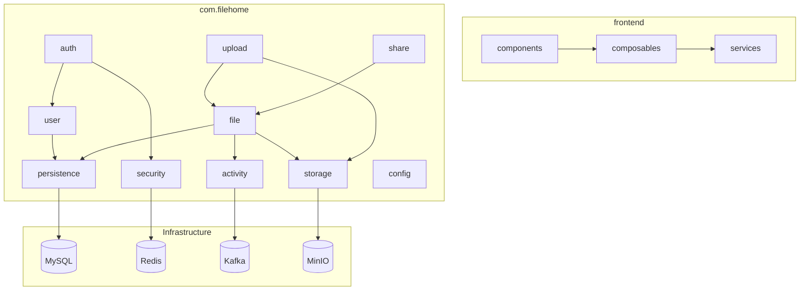
```mermaid
flowchart TB
    subgraph Frontend["frontend"]
        UI["components"]
        Composable["composables"]
        Service["services"]
    end
    subgraph Backend["com.filehome"]
        Auth["auth"]
        User["user"]
        File["file"]
        Upload["upload"]
        Share["share"]
        Activity["activity"]
        Security["security"]
        Storage["storage"]
        Persistence["persistence"]
        Config["config"]
    end
    subgraph Infrastructure["Infrastructure"]
        MySQL[(MySQL)]
        Redis[(Redis)]
        Kafka[(Kafka)]
        MinIO[(MinIO)]
    end

    UI --> Composable --> Service
    Auth --> User
    Auth --> Security
    File --> Storage
    Upload --> File
    Upload --> Storage
    Share --> File
    File --> Activity
    User --> Persistence
    File --> Persistence
    Persistence --> MySQL
    Security --> Redis
    Activity --> Kafka
    Storage --> MinIO
```

## 15. Component Diagram

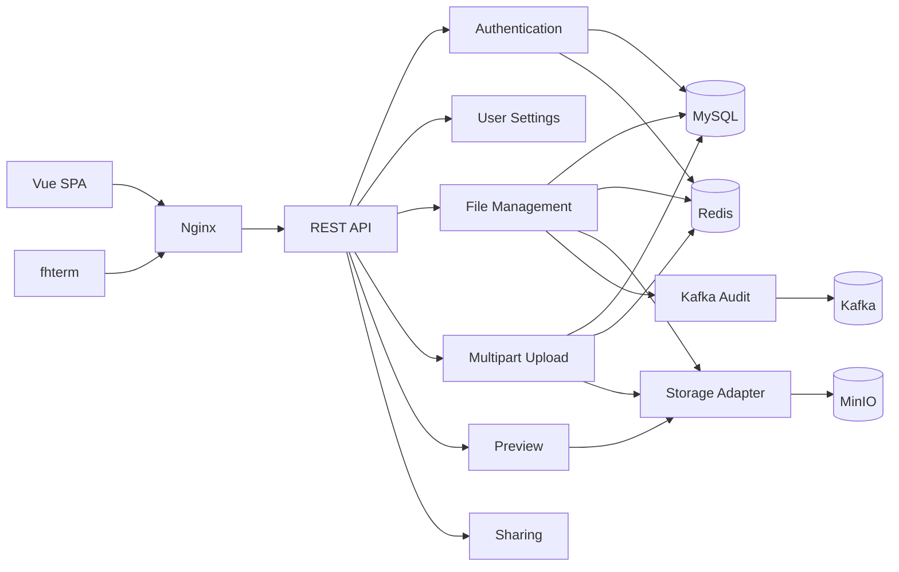
```mermaid
flowchart LR
    SPA["Vue SPA"]
    CLI["fhterm"]
    Proxy["Nginx"]
    API["REST API"]
    Auth["Authentication"]
    Settings["User Settings"]
    Files["File Management"]
    Upload["Multipart Upload"]
    Preview["Preview"]
    Share["Sharing"]
    Audit["Kafka Audit"]
    Storage["Storage Adapter"]
    DB[(MySQL)]
    Redis[(Redis)]
    Kafka[(Kafka)]
    MinIO[(MinIO)]

    SPA --> Proxy
    CLI --> Proxy
    Proxy --> API
    API --> Auth
    API --> Settings
    API --> Files
    API --> Upload
    API --> Preview
    API --> Share
    Auth --> DB
    Auth --> Redis
    Files --> DB
    Files --> Redis
    Upload --> DB
    Upload --> Redis
    Upload --> Storage
    Files --> Storage
    Preview --> Storage
    Files --> Audit
    Audit --> Kafka
    Storage --> MinIO
```

## 16. Composite Structure Diagram

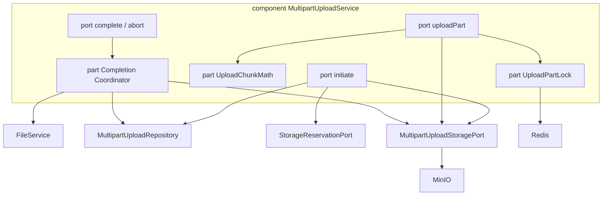
```mermaid
flowchart TB
    subgraph UploadComponent["component MultipartUploadService"]
        InitPort["port initiate"]
        PartPort["port uploadPart"]
        FinishPort["port complete / abort"]
        Math["part UploadChunkMath"]
        Lock["part UploadPartLock"]
        Coordinator["part Completion Coordinator"]
    end
    FileService["FileService"]
    Repo["MultipartUploadRepository"]
    Reservation["StorageReservationPort"]
    ObjectStorage["MultipartUploadStoragePort"]
    Redis["Redis"]
    MinIO["MinIO"]

    InitPort --> Reservation
    InitPort --> ObjectStorage
    InitPort --> Repo
    PartPort --> Math
    PartPort --> Lock
    PartPort --> ObjectStorage
    Lock --> Redis
    FinishPort --> Coordinator
    Coordinator --> FileService
    Coordinator --> Repo
    Coordinator --> ObjectStorage
    ObjectStorage --> MinIO
```

## 17. Deployment Diagram

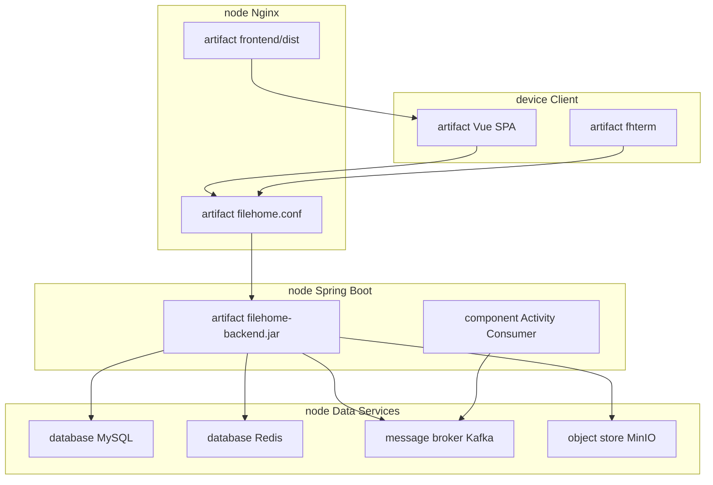
```mermaid
flowchart TB
    subgraph Client["device Client"]
        Browser["artifact Vue SPA"]
        Terminal["artifact fhterm"]
    end
    subgraph Edge["node Nginx"]
        Proxy["artifact filehome.conf"]
        Static["artifact frontend/dist"]
    end
    subgraph App["node Spring Boot"]
        Jar["artifact filehome-backend.jar"]
        Consumer["component Activity Consumer"]
    end
    subgraph Data["node Data Services"]
        MySQL["database MySQL"]
        Redis["database Redis"]
        Kafka["message broker Kafka"]
        MinIO["object store MinIO"]
    end

    Browser --> Proxy
    Terminal --> Proxy
    Static --> Browser
    Proxy --> Jar
    Jar --> MySQL
    Jar --> Redis
    Jar --> Kafka
    Jar --> MinIO
    Consumer --> Kafka
```

Windows development uses the PowerShell scripts. Linux deployment uses Docker Compose. Kafka local mode uses Apache Kafka 4.4.0 in KRaft mode.

## 18. Profile Diagram

```mermaid
classDiagram
    class ApplicationService {
        <<stereotype>>
        @Service
    }
    class RepositoryMapper {
        <<stereotype>>
        @Mapper
    }
    class StorageAdapter {
        <<stereotype>>
        @Component
    }
    class RestController {
        <<stereotype>>
        @RestController
    }
    class KafkaConsumer {
        <<stereotype>>
        @KafkaListener
    }

    RestController --> ApplicationService
    ApplicationService --> RepositoryMapper
    ApplicationService --> StorageAdapter
    ApplicationService --> KafkaConsumer
```

These stereotypes define the allowed dependency direction. Controllers do not access repositories or storage adapters directly.

## 19. Entity Relationship Diagram

```mermaid
erDiagram
    USER_ACCOUNT ||--o| USER_PREFERENCE : has
    USER_ACCOUNT ||--o{ FILE_ENTRY : owns
    USER_ACCOUNT ||--o{ AUTH_SESSION : authenticates
    USER_ACCOUNT ||--o{ UPLOAD_SESSION : starts
    USER_ACCOUNT ||--o{ SHARE_LINK : creates
    USER_ACCOUNT ||--o{ ACTIVITY_LOG : produces
    FILE_ENTRY ||--o| FILE_OBJECT : stores
    FILE_ENTRY ||--o{ FILE_ENTRY : contains
    FILE_ENTRY ||--o| SHARE_LINK : shares
    UPLOAD_SESSION ||--o{ UPLOAD_PART : contains
    SHARE_LINK ||--o{ SHARE_ACCESS_LOG : records

    USER_ACCOUNT {
        char36 id PK
        varchar username UK
        varchar email UK
        boolean is_enabled
        datetime deactivated_at
    }
    FILE_ENTRY {
        char36 id PK
        char36 owner_id FK
        char36 parent_id FK
        enum entry_kind
        varchar name
    }
    FILE_OBJECT {
        char36 entry_id PK
        varchar storage_bucket
        varchar storage_object_key
        bigint size_bytes
    }
    UPLOAD_SESSION {
        char36 id PK
        char36 owner_id FK
        char36 target_entry_id
        bigint size_bytes
        int total_parts
        enum status
    }
    UPLOAD_PART {
        char36 upload_session_id PK
        int part_number PK
        varchar etag
        binary sha256
    }
    ACTIVITY_LOG {
        bigint id PK
        char36 event_id UK
        char36 owner_id FK
        char36 entry_id
    }
```

## 20. API Summary

| Module | Endpoint | Purpose |
| --- | --- | --- |
| Auth | `POST /auth/login` | Browser session |
| Auth | `POST /auth/cli/login` | CLI Bearer token |
| Auth | `GET /auth/session` | Restore session |
| Auth | `POST /auth/logout` | Revoke current session |
| User | `GET /users/me/settings` | Profile and preferences |
| User | `PATCH /users/me/settings` | Update preferences |
| User | `PATCH /users/me/profile` | Update profile |
| User | `POST /users/me/password` | Change password |
| User | `POST /users/me/deactivate` | Deactivate account |
| File | `GET /files` | Cursor-paginated directory |
| File | `POST /files/upload` | Small direct upload |
| File | `GET /files/{id}/preview-access` | Short-lived preview ticket |
| Upload | `POST /uploads` | Multipart session |
| Upload | `PUT /uploads/{id}/parts/{n}` | Raw checksummed part |
| Upload | `POST /uploads/{id}/complete` | Merge multipart |
| Share | `GET /public/shares/{token}` | Public metadata |
| Share | `GET /public/shares/{token}/download` | Authenticated download |
| Media | `GET /media/{id}?ticket=` | Range-streamed preview |

All paths above are under `/api/v1`.

## 21. Security

| Threat | Control |
| --- | --- |
| Token theft through XSS | HttpOnly session cookie, no browser JWT in localStorage |
| CSRF | HMAC-derived `X-CSRF-Token` |
| Session replay | Random opaque token, SHA-256 persistence, immediate revocation |
| IDOR | Owner checks for files, uploads, shares, and sessions |
| Share enumeration | High-entropy tokens; only token hashes are stored |
| Path traversal | Sanitized filenames and internal object-key validation |
| Chunk tampering | Client and server SHA-256 verification |
| Concurrent part overwrite | Redis per-part distributed lock |
| Preview URL leakage | Short-lived HMAC ticket bound to file and scope |
| DOCX external content | CSP, sanitized DOM, external image removal |
| Audit loss | Kafka publisher fallback and idempotent unique event IDs |

Production must use HTTPS. Kafka must use SASL/TLS outside a trusted private network.

## 22. Performance

Implemented optimizations:

- Cursor pagination for directory pages
- Versioned Redis metadata cache
- Redis session resolution cache with full-lifetime revocation markers
- Shared Redis rate limiting
- Kafka asynchronous audit with LZ4, batching, and three consumers
- 16 MiB multipart parts with four concurrent workers
- Quota reservation for concurrent uploads
- Lazy-loaded DOCX renderer
- Configurable Tomcat and HikariCP concurrency

Local reference measurements:

| Scenario | Result |
| --- | --- |
| Session endpoint, 48 workers | median about 1958 req/s, p95 37 ms |
| Directory endpoint, 48 workers | median about 1652 req/s, p95 40.5 ms |
| Health endpoint | median about 2501 req/s |
| 128 MiB multipart upload | about 40-51 MiB/s |

These results are single-node local measurements, not WAN or production capacity claims.

## 23. Traceability

| Requirement | Implementation | UML view |
| --- | --- | --- |
| Secure browser login | auth/session | Use case, sequence, state machine |
| Resumable large upload | upload and MinIO adapter | Activity, sequence, composite structure |
| User settings and deactivation | user and session modules | Use case, class, state machine |
| DOCX preview | preview service and DocxPreview.vue | Sequence, component |
| Kafka audit | activity module | Sequence, component, deployment |
| High-concurrency listing | file service and Redis | Class, component, performance |
| Linux deployment | Compose and Nginx | Deployment |

## 24. Future Work

1. Add Flyway database migrations.
2. Add OpenAPI contracts and CI quality gates.
3. Move recursive copy, ZIP, thumbnails, and scanning to Kafka workers.
4. Run at least three Kafka brokers with replication factor three.
5. Add high availability for MySQL, Redis, MinIO, and Nginx.
6. Add MFA and device management.
7. Add Prometheus, Grafana, OpenTelemetry, and formal load tests.

## 25. Conclusion

File Home is a layered, modular monolith with distributed-friendly boundaries. File bytes, metadata, cache, sessions, and asynchronous events have clear ownership. The current implementation is suitable for a personal cloud drive, coursework, and small deployments. Enterprise readiness depends mainly on operational maturity, high availability, async job isolation, observability, and formal capacity testing.
