# Especificacao de Design de Software do File Home

| Item | Valor |
| --- | --- |
| Sistema | File Home, unidade pessoal em nuvem |
| Versao | 4.0 |
| Data | 2026-11-04 |
| Tecnologias | Spring Boot 4, Vue 3, MySQL, Redis, MinIO, Kafka, Nginx |
| Idioma | Portugues |
| Outras versoes | [中文](./software-design-specification-zh.md) / [English](./software-design-specification-en.md) |

## 1. Objetivo

Este documento descreve o File Home implementado por meio de visoes UML, regras de engenharia, contratos de dados e limites de implantacao. O sistema e um monolito modular com separacao clara entre metadados persistentes, cache reconstruivel, objetos binarios e eventos assincronos.

## 2. Escopo

Funcionalidades implementadas:

- Registro, login no navegador, logout, troca de senha e desativacao da conta
- Sessao HttpOnly, protecao CSRF, limite de requisicoes e revogacao imediata
- Upload, normalizacao e remocao de avatar
- Navegacao, pesquisa, ordenacao, renomeacao, movimentacao, copia e lixeira
- Upload direto de arquivos pequenos e upload retomavel acima de 8 MiB
- Multipart Upload no MinIO, SHA-256 por parte, bloqueio Redis e reserva de cota
- Download em streaming, ZIP de pasta e preview com Range
- Preview somente leitura de imagem, audio, video, PDF, texto, codigo e DOCX
- Links de compartilhamento aleatorios, codigo de extracao e download autenticado
- Auditoria assincrona com Kafka e consumidor idempotente
- Preferencias do usuario e concorrencia de upload configuravel de 1 a 4
- CLI `fhterm` para cmd.exe, PowerShell, Git Bash e Linux
- Implantacao Windows por scripts e Linux por Docker Compose

Limites atuais:

- A infraestrutura local ainda e de no unico
- O topico Kafka local usa fator de replicacao 1
- Nao existe MFA, antivirus, CDN ou conversao Office no servidor
- Copia recursiva, ZIP e exclusao recursiva ainda executam no processo web
- Arquivos `.doc` antigos nao sao renderizados

## 3. Atores

| Ator | Responsabilidade |
| --- | --- |
| Visitante | Abre um compartilhamento publico |
| Usuario registrado | Gerencia arquivos, compartilhamentos e configuracoes |
| Usuario da CLI | Usa a mesma API REST pelo `fhterm` |
| Operacao | Inicia servicos, verifica saude, backup e logs |
| Consumidor Kafka | Grava eventos de atividade de forma assincrona |

## 4. Contexto do Sistema

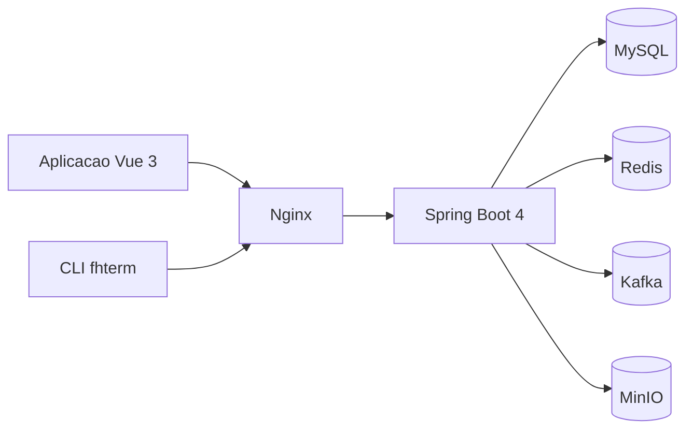
```mermaid
flowchart LR
    Browser["Aplicacao Vue 3"]
    CLI["CLI fhterm"]
    Nginx["Nginx"]
    Backend["Spring Boot 4"]
    MySQL[("MySQL")]
    Redis[("Redis")]
    Kafka[("Kafka")]
    MinIO[("MinIO")]

    Browser --> Nginx
    CLI --> Nginx
    Nginx --> Backend
    Backend --> MySQL
    Backend --> Redis
    Backend --> Kafka
    Backend --> MinIO
```

Decisoes principais:

1. Metadados fortemente consistentes ficam no MySQL.
2. Redis armazena apenas dados reconstruiveis, limites, sessoes e bloqueios.
3. Byte de arquivo e avatar ficam no MinIO.
4. Kafka transporta somente eventos assincronos de auditoria.
5. O navegador nunca recebe credenciais MinIO nem o Upload ID do MinIO.
6. Controllers nao acessam MyBatis ou MinIO diretamente.

## 5. Diagrama de Casos de Uso

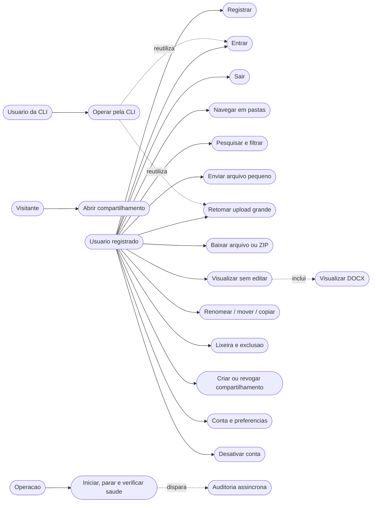
```mermaid
flowchart LR
    Visitor(["Visitante"])
    User(["Usuario registrado"])
    CliUser(["Usuario da CLI"])
    Ops(["Operacao"])

    OpenShare(["Abrir compartilhamento"])
    Register(["Registrar"])
    Login(["Entrar"])
    Logout(["Sair"])
    Browse(["Navegar em pastas"])
    Search(["Pesquisar e filtrar"])
    UploadSmall(["Enviar arquivo pequeno"])
    UploadLarge(["Retomar upload grande"])
    Download(["Baixar arquivo ou ZIP"])
    Preview(["Visualizar sem editar"])
    Docx(["Visualizar DOCX"])
    Mutate(["Renomear / mover / copiar"])
    Trash(["Lixeira e exclusao"])
    Share(["Criar ou revogar compartilhamento"])
    Settings(["Conta e preferencias"])
    Deactivate(["Desativar conta"])
    Cli(["Operar pela CLI"])
    Operate(["Iniciar, parar e verificar saude"])
    Audit(["Auditoria assincrona"])

    Visitor --> OpenShare
    User --> Register
    User --> Login
    User --> Logout
    User --> Browse
    User --> Search
    User --> UploadSmall
    User --> UploadLarge
    User --> Download
    User --> Preview
    Preview -.->|inclui| Docx
    User --> Mutate
    User --> Trash
    User --> Share
    User --> Settings
    User --> Deactivate
    CliUser --> Cli
    Cli -.->|reutiliza| Login
    Cli -.->|reutiliza| UploadLarge
    Ops --> Operate
    Operate -.->|dispara| Audit
```

Regras:

- Toda operacao de arquivo valida o proprietario.
- Links publicos nao contem ID de banco nem chave de objeto.
- Compartilhamento de pasta e recursivo por relacionamento.
- Desativacao bloqueia login e revoga sessoes sem apagar os dados imediatamente.
- O historico de auditoria pode referenciar uma entrada ja excluida.

## 6. Diagrama de Atividade

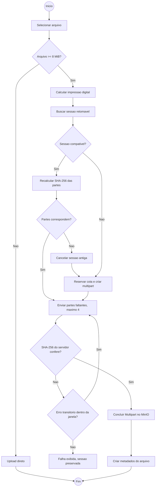
```mermaid
flowchart TD
    Start((Inicio))
    Select["Selecionar arquivo"]
    Large{"Arquivo >= 8 MiB?"}
    Small["Upload direto"]
    Fingerprint["Calcular impressao digital"]
    Find["Buscar sessao retomavel"]
    Exists{"Sessao compativel?"}
    Verify["Recalcular SHA-256 das partes"]
    Match{"Partes correspondem?"}
    AbortOld["Cancelar sessao antiga"]
    Init["Reservar cota e criar multipart"]
    Transfer["Enviar partes faltantes, maximo 4"]
    Integrity{"SHA-256 do servidor confere?"}
    Retryable{"Erro transitorio dentro da janela?"}
    Failed["Falha exibida, sessao preservada"]
    Complete["Concluir Multipart no MinIO"]
    Register["Criar metadados do arquivo"]
    End((Fim))

    Start --> Select --> Large
    Large -->|Nao| Small --> End
    Large -->|Sim| Fingerprint --> Find --> Exists
    Exists -->|Sim| Verify --> Match
    Match -->|Sim| Transfer
    Match -->|Nao| AbortOld --> Init
    Exists -->|Nao| Init --> Transfer
    Transfer --> Integrity
    Integrity -->|Nao| Retryable
    Retryable -->|Sim| Transfer
    Retryable -->|Nao| Failed
    Integrity -->|Sim| Complete --> Register --> End
```

## 7. Diagramas de Sequencia

### 7.1 Login e sessao

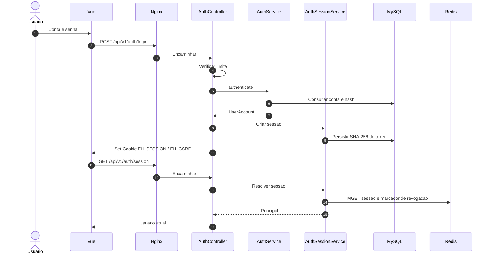
```mermaid
sequenceDiagram
    autonumber
    actor U as Usuario
    participant B as Vue
    participant N as Nginx
    participant A as AuthController
    participant S as AuthService
    participant R as AuthSessionService
    participant D as MySQL
    participant C as Redis

    U->>B: Conta e senha
    B->>N: POST /api/v1/auth/login
    N->>A: Encaminhar
    A->>A: Verificar limite
    A->>S: authenticate
    S->>D: Consultar conta e hash
    S-->>A: UserAccount
    A->>R: Criar sessao
    R->>D: Persistir SHA-256 do token
    A-->>B: Set-Cookie FH_SESSION / FH_CSRF
    B->>N: GET /api/v1/auth/session
    N->>A: Encaminhar
    A->>R: Resolver sessao
    R->>C: MGET sessao e marcador de revogacao
    R-->>A: Principal
    A-->>B: Usuario atual
```

### 7.2 Upload Multipart

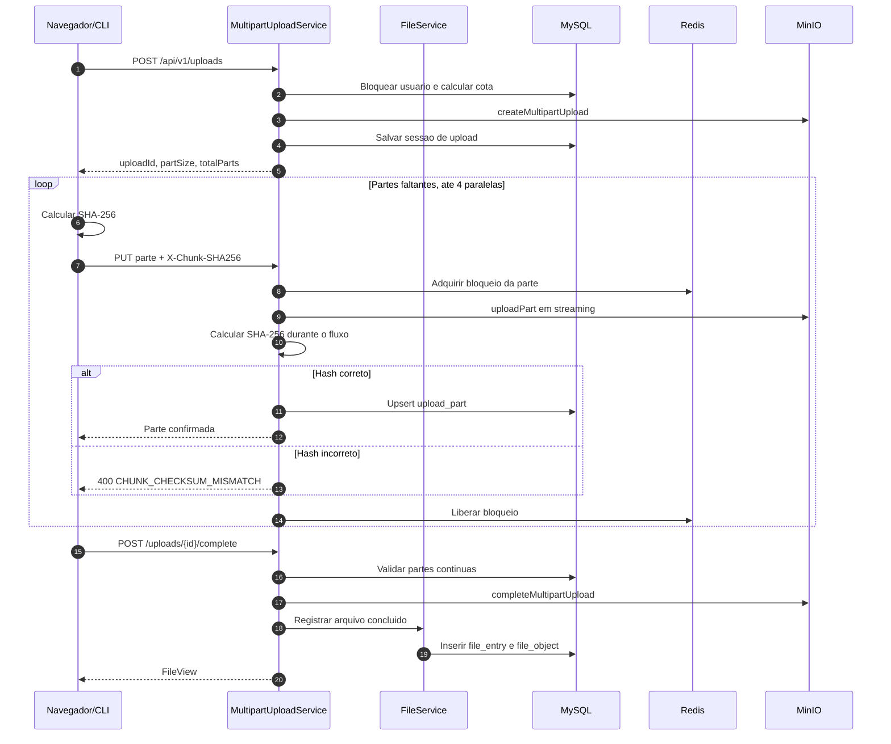
```mermaid
sequenceDiagram
    autonumber
    participant B as Navegador/CLI
    participant U as MultipartUploadService
    participant F as FileService
    participant Q as MySQL
    participant L as Redis
    participant M as MinIO

    B->>U: POST /api/v1/uploads
    U->>Q: Bloquear usuario e calcular cota
    U->>M: createMultipartUpload
    U->>Q: Salvar sessao de upload
    U-->>B: uploadId, partSize, totalParts
    loop Partes faltantes, ate 4 paralelas
        B->>B: Calcular SHA-256
        B->>U: PUT parte + X-Chunk-SHA256
        U->>L: Adquirir bloqueio da parte
        U->>M: uploadPart em streaming
        U->>U: Calcular SHA-256 durante o fluxo
        alt Hash correto
            U->>Q: Upsert upload_part
            U-->>B: Parte confirmada
        else Hash incorreto
            U-->>B: 400 CHUNK_CHECKSUM_MISMATCH
        end
        U->>L: Liberar bloqueio
    end
    B->>U: POST /uploads/{id}/complete
    U->>Q: Validar partes continuas
    U->>M: completeMultipartUpload
    U->>F: Registrar arquivo concluido
    F->>Q: Inserir file_entry e file_object
    U-->>B: FileView
```

### 7.3 Preview DOCX

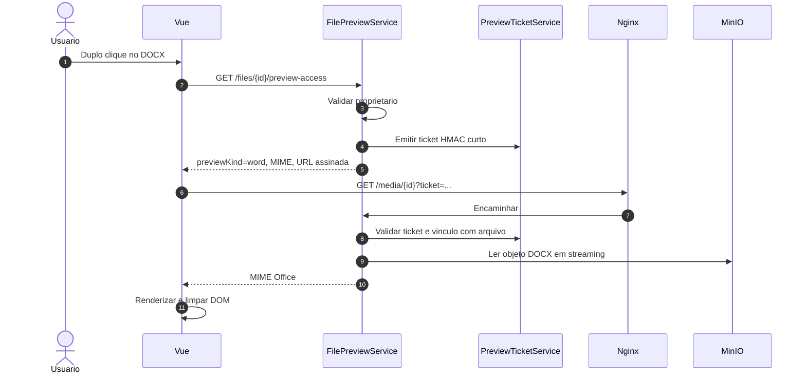
```mermaid
sequenceDiagram
    autonumber
    actor U as Usuario
    participant B as Vue
    participant P as FilePreviewService
    participant T as PreviewTicketService
    participant N as Nginx
    participant M as MinIO

    U->>B: Duplo clique no DOCX
    B->>P: GET /files/{id}/preview-access
    P->>P: Validar proprietario
    P->>T: Emitir ticket HMAC curto
    P-->>B: previewKind=word, MIME, URL assinada
    B->>N: GET /media/{id}?ticket=...
    N->>P: Encaminhar
    P->>T: Validar ticket e vinculo com arquivo
    P->>M: Ler objeto DOCX em streaming
    P-->>B: MIME Office
    B->>B: Renderizar e limpar DOM
```

### 7.4 Auditoria Kafka

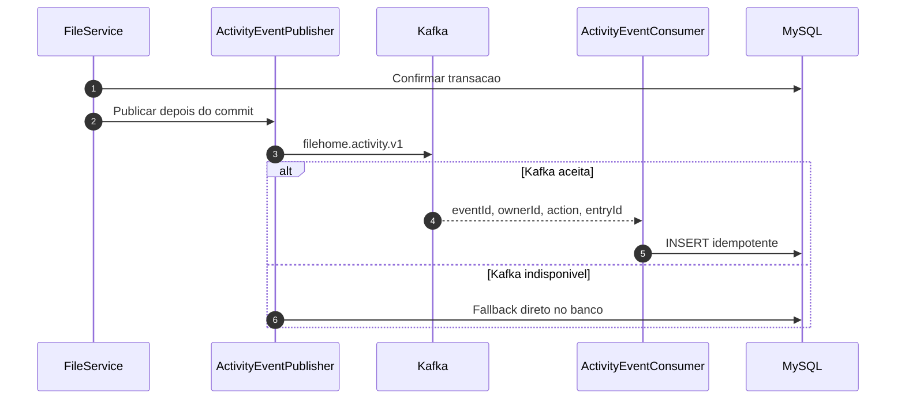
```mermaid
sequenceDiagram
    autonumber
    participant F as FileService
    participant P as ActivityEventPublisher
    participant K as Kafka
    participant C as ActivityEventConsumer
    participant D as MySQL

    F->>D: Confirmar transacao
    F->>P: Publicar depois do commit
    P->>K: filehome.activity.v1
    alt Kafka aceita
        K-->>C: eventId, ownerId, action, entryId
        C->>D: INSERT idempotente
    else Kafka indisponivel
        P->>D: Fallback direto no banco
    end
```

## 8. Diagrama de Comunicacao

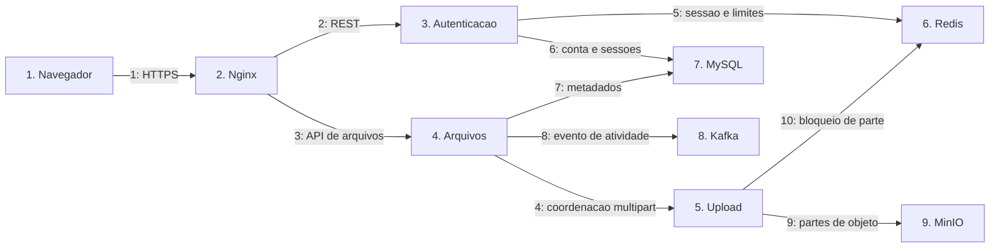
```mermaid
flowchart LR
    Browser["1. Navegador"]
    Nginx["2. Nginx"]
    Auth["3. Autenticacao"]
    File["4. Arquivos"]
    Upload["5. Upload"]
    Redis["6. Redis"]
    MySQL["7. MySQL"]
    Kafka["8. Kafka"]
    MinIO["9. MinIO"]

    Browser -- "1: HTTPS" --> Nginx
    Nginx -- "2: REST" --> Auth
    Nginx -- "3: API de arquivos" --> File
    File -- "4: coordenacao multipart" --> Upload
    Auth -- "5: sessao e limites" --> Redis
    Auth -- "6: conta e sessoes" --> MySQL
    File -- "7: metadados" --> MySQL
    File -- "8: evento de atividade" --> Kafka
    Upload -- "9: partes de objeto" --> MinIO
    Upload -- "10: bloqueio de parte" --> Redis
```

## 9. Diagrama de Visao Geral de Interacao

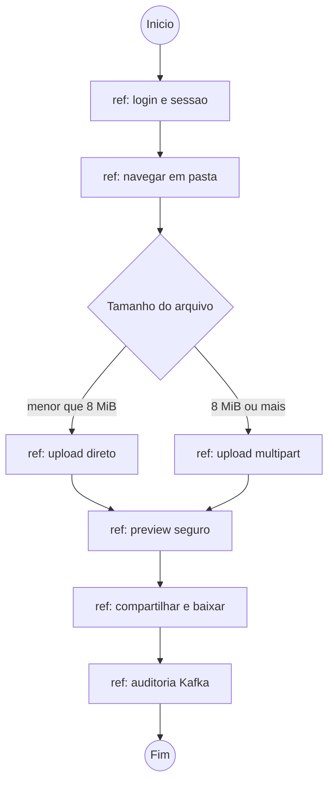
```mermaid
flowchart TD
    Start((Inicio))
    Login["ref: login e sessao"]
    Browse["ref: navegar em pasta"]
    Decision{"Tamanho do arquivo"}
    Small["ref: upload direto"]
    Large["ref: upload multipart"]
    Preview["ref: preview seguro"]
    Share["ref: compartilhar e baixar"]
    Audit["ref: auditoria Kafka"]
    End((Fim))

    Start --> Login --> Browse --> Decision
    Decision -->|menor que 8 MiB| Small
    Decision -->|8 MiB ou mais| Large
    Small --> Preview
    Large --> Preview
    Preview --> Share --> Audit --> End
```

## 10. Diagrama de Tempo

```mermaid
gantt
    title Tempo de sessao e recuperacao multipart
    dateFormat X
    axisFormat %S
    section Sessao
    Sessao valida :active, s1, 0, 3600
    section Upload
    Quatro partes paralelas :a1, 10, 25
    Interrupcao de rede :crit, a2, 35, 20
    Backoff exponencial com jitter :a3, 35, 46
    Sessao permanece retomavel :active, a4, 35, 100
    Recolher arquivo novamente :milestone, m1, 82, 0
```

Politica de retry:

- APIs idempotentes comuns costumam usar tres tentativas.
- Operacoes longas e retomaveis costumam usar cinco a oito tentativas.
- O File Home usa ate oito tentativas com backoff exponencial e jitter.
- A sessao do servidor permanece valida por 48 horas.

## 11. Diagramas de Maquina de Estado

### 11.1 Ciclo de vida do arquivo

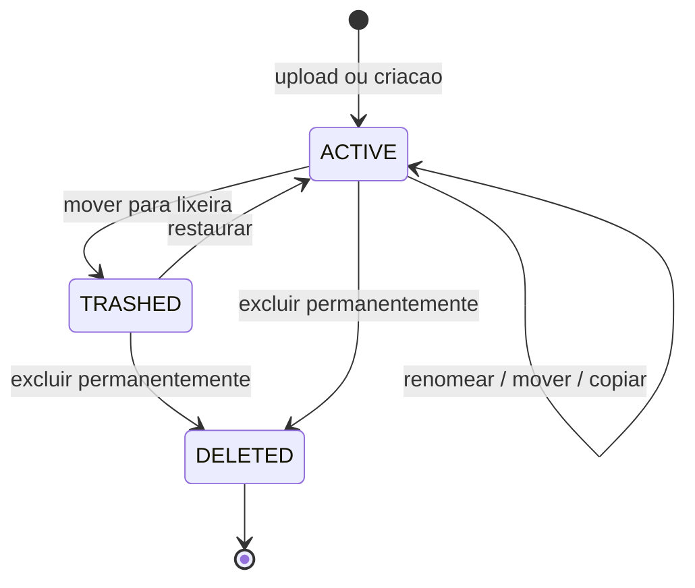
```mermaid
stateDiagram-v2
    [*] --> ACTIVE: upload ou criacao
    ACTIVE --> ACTIVE: renomear / mover / copiar
    ACTIVE --> TRASHED: mover para lixeira
    TRASHED --> ACTIVE: restaurar
    TRASHED --> DELETED: excluir permanentemente
    ACTIVE --> DELETED: excluir permanentemente
    DELETED --> [*]
```

### 11.2 Ciclo de vida do upload

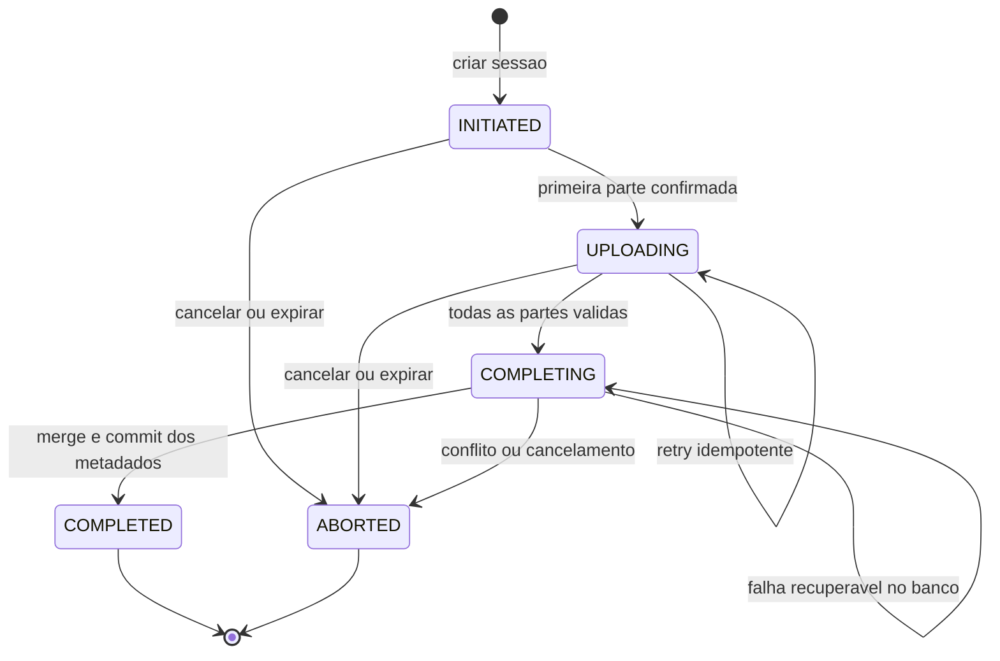
```mermaid
stateDiagram-v2
    [*] --> INITIATED: criar sessao
    INITIATED --> UPLOADING: primeira parte confirmada
    UPLOADING --> UPLOADING: retry idempotente
    UPLOADING --> COMPLETING: todas as partes validas
    COMPLETING --> COMPLETED: merge e commit dos metadados
    COMPLETING --> COMPLETING: falha recuperavel no banco
    INITIATED --> ABORTED: cancelar ou expirar
    UPLOADING --> ABORTED: cancelar ou expirar
    COMPLETING --> ABORTED: conflito ou cancelamento
    COMPLETED --> [*]
    ABORTED --> [*]
```

### 11.3 Ciclo de vida da conta

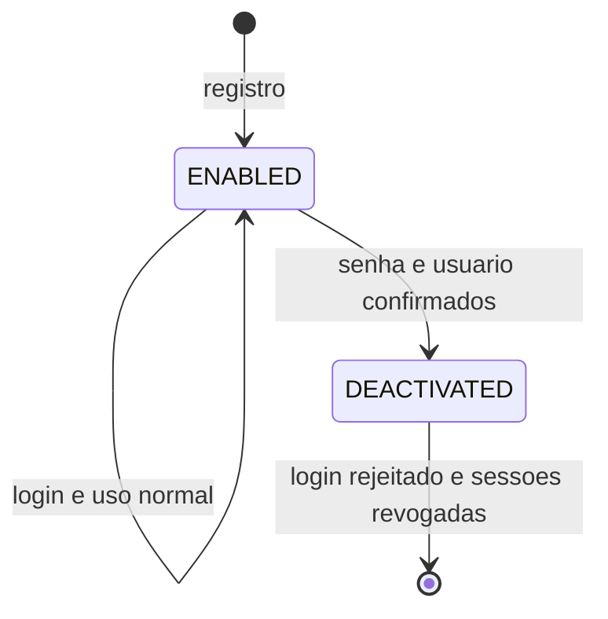
```mermaid
stateDiagram-v2
    [*] --> ENABLED: registro
    ENABLED --> ENABLED: login e uso normal
    ENABLED --> DEACTIVATED: senha e usuario confirmados
    DEACTIVATED --> [*]: login rejeitado e sessoes revogadas
```

## 12. Diagramas de Classe

### 12.1 Modelo de dominio

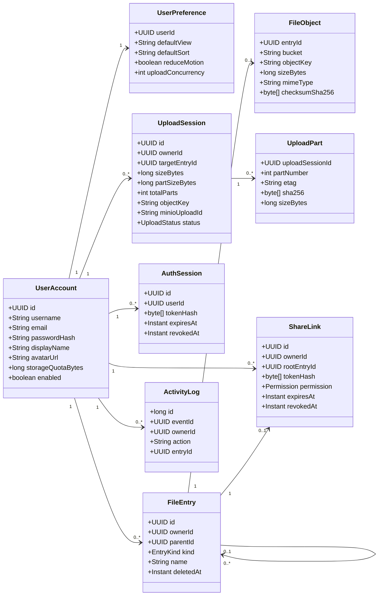
```mermaid
classDiagram
    direction LR
    class UserAccount {
        +UUID id
        +String username
        +String email
        +String passwordHash
        +String displayName
        +String avatarUrl
        +long storageQuotaBytes
        +boolean enabled
    }
    class UserPreference {
        +UUID userId
        +String defaultView
        +String defaultSort
        +boolean reduceMotion
        +int uploadConcurrency
    }
    class FileEntry {
        +UUID id
        +UUID ownerId
        +UUID parentId
        +EntryKind kind
        +String name
        +Instant deletedAt
    }
    class FileObject {
        +UUID entryId
        +String bucket
        +String objectKey
        +long sizeBytes
        +String mimeType
        +byte[] checksumSha256
    }
    class AuthSession {
        +UUID id
        +UUID userId
        +byte[] tokenHash
        +Instant expiresAt
        +Instant revokedAt
    }
    class UploadSession {
        +UUID id
        +UUID ownerId
        +UUID targetEntryId
        +long sizeBytes
        +long partSizeBytes
        +int totalParts
        +String objectKey
        +String minioUploadId
        +UploadStatus status
    }
    class UploadPart {
        +UUID uploadSessionId
        +int partNumber
        +String etag
        +byte[] sha256
        +long sizeBytes
    }
    class ShareLink {
        +UUID id
        +UUID ownerId
        +UUID rootEntryId
        +byte[] tokenHash
        +Permission permission
        +Instant expiresAt
        +Instant revokedAt
    }
    class ActivityLog {
        +long id
        +UUID eventId
        +UUID ownerId
        +String action
        +UUID entryId
    }

    UserAccount "1" --> "1" UserPreference
    UserAccount "1" --> "0..*" FileEntry
    UserAccount "1" --> "0..*" AuthSession
    UserAccount "1" --> "0..*" UploadSession
    UserAccount "1" --> "0..*" ShareLink
    UserAccount "1" --> "0..*" ActivityLog
    FileEntry "0..1" --> "0..*" FileEntry
    FileEntry "1" --> "0..1" FileObject
    UploadSession "1" --> "0..*" UploadPart
    FileEntry "1" --> "0..1" ShareLink
```

### 12.2 Servicos e portas

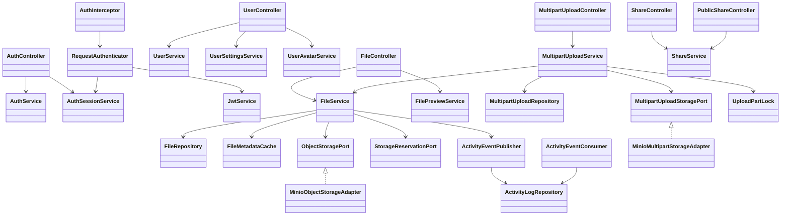
```mermaid
classDiagram
    AuthController --> AuthService
    AuthController --> AuthSessionService
    AuthInterceptor --> RequestAuthenticator
    RequestAuthenticator --> JwtService
    RequestAuthenticator --> AuthSessionService

    UserController --> UserService
    UserController --> UserSettingsService
    UserController --> UserAvatarService

    FileController --> FileService
    FileController --> FilePreviewService
    FileService --> FileRepository
    FileService --> FileMetadataCache
    FileService --> ObjectStoragePort
    FileService --> StorageReservationPort

    MultipartUploadController --> MultipartUploadService
    MultipartUploadService --> MultipartUploadRepository
    MultipartUploadService --> MultipartUploadStoragePort
    MultipartUploadService --> UploadPartLock
    MultipartUploadService --> FileService

    ShareController --> ShareService
    PublicShareController --> ShareService
    FileService --> ActivityEventPublisher
    ActivityEventPublisher --> ActivityLogRepository
    ActivityEventConsumer --> ActivityLogRepository

    ObjectStoragePort <|.. MinioObjectStorageAdapter
    MultipartUploadStoragePort <|.. MinioMultipartStorageAdapter
```

## 13. Diagrama de Objetos

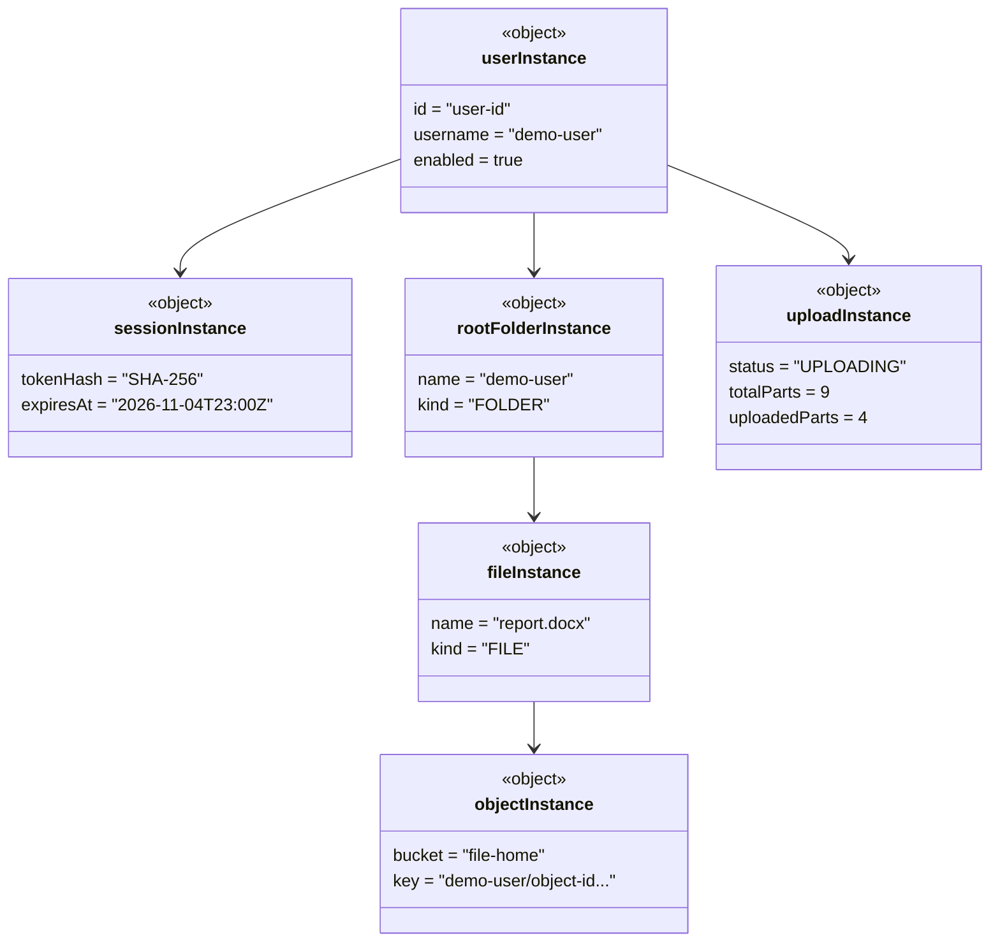
```mermaid
classDiagram
    class userInstance {
        <<object>>
        id = "user-id"
        username = "demo-user"
        enabled = true
    }
    class sessionInstance {
        <<object>>
        tokenHash = "SHA-256"
        expiresAt = "2026-11-04T23:00Z"
    }
    class rootFolderInstance {
        <<object>>
        name = "demo-user"
        kind = "FOLDER"
    }
    class fileInstance {
        <<object>>
        name = "report.docx"
        kind = "FILE"
    }
    class uploadInstance {
        <<object>>
        status = "UPLOADING"
        totalParts = 9
        uploadedParts = 4
    }
    class objectInstance {
        <<object>>
        bucket = "file-home"
        key = "demo-user/object-id..."
    }

    userInstance --> sessionInstance
    userInstance --> rootFolderInstance
    rootFolderInstance --> fileInstance
    fileInstance --> objectInstance
    userInstance --> uploadInstance
```

## 14. Diagrama de Pacotes

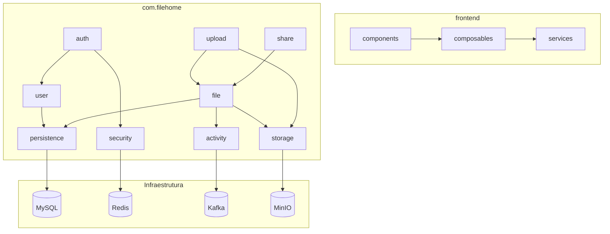
```mermaid
flowchart TB
    subgraph Frontend["frontend"]
        UI["components"]
        Composable["composables"]
        Service["services"]
    end
    subgraph Backend["com.filehome"]
        Auth["auth"]
        User["user"]
        File["file"]
        Upload["upload"]
        Share["share"]
        Activity["activity"]
        Security["security"]
        Storage["storage"]
        Persistence["persistence"]
    end
    subgraph Infra["Infraestrutura"]
        MySQL[(MySQL)]
        Redis[(Redis)]
        Kafka[(Kafka)]
        MinIO[(MinIO)]
    end

    UI --> Composable --> Service
    Auth --> User
    Auth --> Security
    File --> Storage
    Upload --> File
    Upload --> Storage
    Share --> File
    File --> Activity
    User --> Persistence
    File --> Persistence
    Persistence --> MySQL
    Security --> Redis
    Activity --> Kafka
    Storage --> MinIO
```

## 15. Diagrama de Componentes

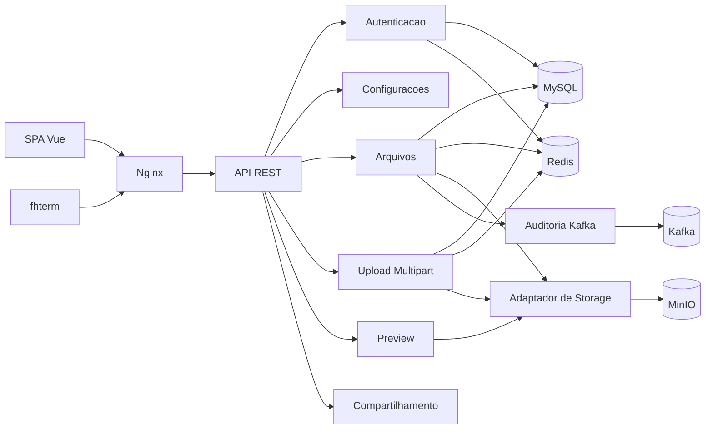
```mermaid
flowchart LR
    SPA["SPA Vue"]
    CLI["fhterm"]
    Proxy["Nginx"]
    API["API REST"]
    Auth["Autenticacao"]
    Settings["Configuracoes"]
    Files["Arquivos"]
    Upload["Upload Multipart"]
    Preview["Preview"]
    Share["Compartilhamento"]
    Audit["Auditoria Kafka"]
    Storage["Adaptador de Storage"]
    DB[(MySQL)]
    Redis[(Redis)]
    Kafka[(Kafka)]
    MinIO[(MinIO)]

    SPA --> Proxy
    CLI --> Proxy
    Proxy --> API
    API --> Auth
    API --> Settings
    API --> Files
    API --> Upload
    API --> Preview
    API --> Share
    Auth --> DB
    Auth --> Redis
    Files --> DB
    Files --> Redis
    Upload --> DB
    Upload --> Redis
    Upload --> Storage
    Files --> Storage
    Preview --> Storage
    Files --> Audit
    Audit --> Kafka
    Storage --> MinIO
```

## 16. Diagrama de Estrutura Composta

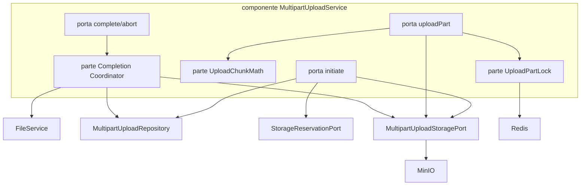
```mermaid
flowchart TB
    subgraph UploadComponent["componente MultipartUploadService"]
        InitPort["porta initiate"]
        PartPort["porta uploadPart"]
        FinishPort["porta complete/abort"]
        Math["parte UploadChunkMath"]
        Lock["parte UploadPartLock"]
        Coordinator["parte Completion Coordinator"]
    end
    FileService["FileService"]
    Repo["MultipartUploadRepository"]
    Reservation["StorageReservationPort"]
    ObjectStorage["MultipartUploadStoragePort"]
    Redis["Redis"]
    MinIO["MinIO"]

    InitPort --> Reservation
    InitPort --> ObjectStorage
    InitPort --> Repo
    PartPort --> Math
    PartPort --> Lock
    PartPort --> ObjectStorage
    Lock --> Redis
    FinishPort --> Coordinator
    Coordinator --> FileService
    Coordinator --> Repo
    Coordinator --> ObjectStorage
    ObjectStorage --> MinIO
```

## 17. Diagrama de Implantacao

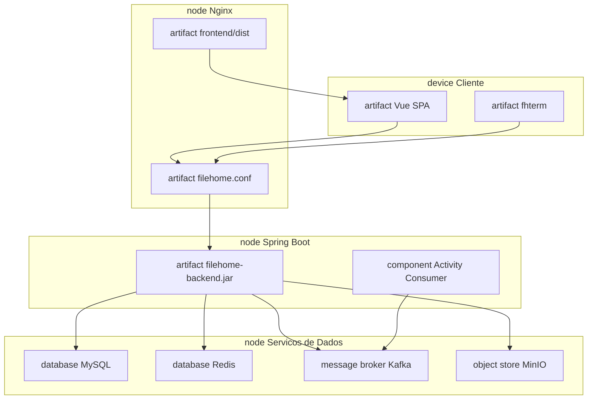
```mermaid
flowchart TB
    subgraph Client["device Cliente"]
        Browser["artifact Vue SPA"]
        Terminal["artifact fhterm"]
    end
    subgraph Edge["node Nginx"]
        Proxy["artifact filehome.conf"]
        Static["artifact frontend/dist"]
    end
    subgraph App["node Spring Boot"]
        Jar["artifact filehome-backend.jar"]
        Consumer["component Activity Consumer"]
    end
    subgraph Data["node Servicos de Dados"]
        MySQL["database MySQL"]
        Redis["database Redis"]
        Kafka["message broker Kafka"]
        MinIO["object store MinIO"]
    end

    Browser --> Proxy
    Terminal --> Proxy
    Static --> Browser
    Proxy --> Jar
    Jar --> MySQL
    Jar --> Redis
    Jar --> Kafka
    Jar --> MinIO
    Consumer --> Kafka
```

No Windows, o desenvolvimento usa PowerShell. No Linux, recomenda-se Docker Compose. O Kafka local usa Apache Kafka 4.4.0 no modo KRaft.

## 18. Diagrama de Perfil

```mermaid
classDiagram
    class ApplicationService {
        <<stereotype>>
        @Service
    }
    class RepositoryMapper {
        <<stereotype>>
        @Mapper
    }
    class StorageAdapter {
        <<stereotype>>
        @Component
    }
    class RestController {
        <<stereotype>>
        @RestController
    }
    class KafkaConsumer {
        <<stereotype>>
        @KafkaListener
    }

    RestController --> ApplicationService
    ApplicationService --> RepositoryMapper
    ApplicationService --> StorageAdapter
    ApplicationService --> KafkaConsumer
```

Os estereotipos definem a direcao permitida das dependencias. Controllers nao acessam repositorios ou adaptadores de storage diretamente.

## 19. Diagrama de Entidade e Relacionamento

```mermaid
erDiagram
    USER_ACCOUNT ||--o| USER_PREFERENCE : possui
    USER_ACCOUNT ||--o{ FILE_ENTRY : possui
    USER_ACCOUNT ||--o{ AUTH_SESSION : autentica
    USER_ACCOUNT ||--o{ UPLOAD_SESSION : inicia
    USER_ACCOUNT ||--o{ SHARE_LINK : cria
    USER_ACCOUNT ||--o{ ACTIVITY_LOG : produz
    FILE_ENTRY ||--o| FILE_OBJECT : armazena
    FILE_ENTRY ||--o{ FILE_ENTRY : contem
    FILE_ENTRY ||--o| SHARE_LINK : compartilha
    UPLOAD_SESSION ||--o{ UPLOAD_PART : contem
    SHARE_LINK ||--o{ SHARE_ACCESS_LOG : registra

    USER_ACCOUNT {
        char36 id PK
        varchar username UK
        varchar email UK
        boolean is_enabled
        datetime deactivated_at
    }
    FILE_ENTRY {
        char36 id PK
        char36 owner_id FK
        char36 parent_id FK
        enum entry_kind
        varchar name
    }
    FILE_OBJECT {
        char36 entry_id PK
        varchar storage_bucket
        varchar storage_object_key
        bigint size_bytes
    }
    UPLOAD_SESSION {
        char36 id PK
        char36 owner_id FK
        char36 target_entry_id
        bigint size_bytes
        int total_parts
        enum status
    }
    UPLOAD_PART {
        char36 upload_session_id PK
        int part_number PK
        varchar etag
        binary sha256
    }
    ACTIVITY_LOG {
        bigint id PK
        char36 event_id UK
        char36 owner_id FK
        char36 entry_id
    }
```

## 20. Resumo da API

| Modulo | Endpoint | Finalidade |
| --- | --- | --- |
| Auth | `POST /auth/login` | Sessao do navegador |
| Auth | `POST /auth/cli/login` | Token Bearer da CLI |
| Auth | `GET /auth/session` | Restaurar sessao |
| Auth | `POST /auth/logout` | Revogar sessao atual |
| User | `GET /users/me/settings` | Perfil e preferencias |
| User | `PATCH /users/me/settings` | Atualizar preferencias |
| User | `PATCH /users/me/profile` | Atualizar perfil |
| User | `POST /users/me/password` | Trocar senha |
| User | `POST /users/me/deactivate` | Desativar conta |
| File | `GET /files` | Lista paginada por cursor |
| File | `POST /files/upload` | Upload direto pequeno |
| File | `GET /files/{id}/preview-access` | Ticket curto de preview |
| Upload | `POST /uploads` | Criar sessao multipart |
| Upload | `PUT /uploads/{id}/parts/{n}` | Parte binaria com checksum |
| Upload | `POST /uploads/{id}/complete` | Concluir multipart |
| Share | `GET /public/shares/{token}` | Metadados publicos |
| Share | `GET /public/shares/{token}/download` | Download autenticado |
| Media | `GET /media/{id}?ticket=` | Preview com Range |

Todos os caminhos pertencem a `/api/v1`.

## 21. Seguranca

| Ameaca | Controle |
| --- | --- |
| Roubo de token por XSS | Cookie HttpOnly e nenhum JWT no localStorage |
| CSRF | `X-CSRF-Token` derivado por HMAC |
| Replay de sessao | Token opaco, hash SHA-256 e revogacao imediata |
| IDOR | Validacao de proprietario em arquivo, upload, share e sessao |
| Enumeracao de links | Token aleatorio; apenas o hash e persistido |
| Path traversal | Nome sanitizado e validacao de object key |
| Corrupcao de parte | SHA-256 no cliente e no servidor |
| Sobrescrita concorrente | Bloqueio Redis por parte |
| Vazamento de preview | Ticket HMAC curto ligado ao arquivo |
| Conteudo externo em DOCX | CSP, limpeza do DOM e remocao de imagens externas |
| Perda de auditoria | Fallback no banco e eventId unico |

Producao deve usar HTTPS. Kafka deve usar SASL/TLS fora de uma rede privada confiavel.

## 22. Desempenho

Otimizacoes implementadas:

- Paginacao por cursor
- Cache Redis versionado para metadados
- Cache Redis para resolucao de sessao
- Limites compartilhados no Redis
- Auditoria Kafka com LZ4, batching e tres consumidores
- Partes de 16 MiB com quatro workers paralelos
- Reserva de cota para uploads concorrentes
- Renderizador DOCX carregado sob demanda
- Parametros de Tomcat e HikariCP configuraveis

Medicoes locais:

| Cenario | Resultado |
| --- | --- |
| Sessao, 48 concorrentes | mediana de 1958 req/s, p95 de 37 ms |
| Diretorio, 48 concorrentes | mediana de 1652 req/s, p95 de 40,5 ms |
| Health check | mediana de 2501 req/s |
| Upload de 128 MiB | cerca de 40 a 51 MiB/s |

Sao medidas locais de um no, nao capacidade de producao.

## 23. Rastreabilidade

| Requisito | Implementacao | Visao UML |
| --- | --- | --- |
| Login seguro | auth/session | Casos de uso, sequencia, estado |
| Upload retomavel | upload e adaptador MinIO | Atividade, sequencia, estrutura composta |
| Configuracoes e desativacao | modulos user e session | Casos de uso, classe, estado |
| Preview DOCX | preview e DocxPreview.vue | Sequencia, componentes |
| Auditoria Kafka | modulo activity | Sequencia, componentes, implantacao |
| Listagem de alta concorrencia | files e Redis | Classe, componentes, desempenho |
| Implantacao Linux | Compose e Nginx | Implantacao |

## 24. Evolucao Futura

1. Adicionar Flyway.
2. Adicionar contratos OpenAPI e validacoes de CI.
3. Mover copia recursiva, ZIP, miniaturas e antivirus para workers Kafka.
4. Usar pelo menos tres brokers Kafka com fator de replicacao tres.
5. Adicionar alta disponibilidade para MySQL, Redis, MinIO e Nginx.
6. Adicionar MFA e gerenciamento de dispositivos.
7. Adicionar Prometheus, Grafana, OpenTelemetry e testes formais de carga.

## 25. Conclusao

O File Home possui uma arquitetura em camadas com limites adequados para evolucao distribuida. Bytes de arquivo, metadados, cache, sessoes e eventos assincronos tem responsabilidades claras. A implementacao atual atende um drive pessoal e pequenas implantacoes. A prontidao empresarial depende principalmente de alta disponibilidade, isolamento de tarefas assincronas, observabilidade e testes de capacidade.
